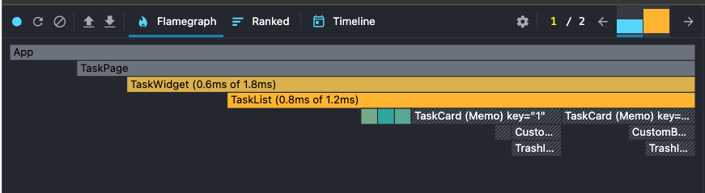
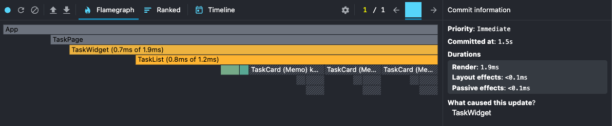

# LESSON-2 - Оптимизация производительности

Ветка: lesson-2

## Запуск

npm ci && npm run dev
npm run build

# Чек-лист

1. Выполнена оптимизация TaskCard с помощью React.memo
2. Мемоизация списка задач с useMemo была выполнена в ветке lesson-1
3. Выполнена мемоизация функций removeTask с useCallback
4. Выполнено доп задание

# Дополнительная задача

## Анализ производительности через DevTools

Фильтрация

Удаление карточки

Вывод: Компоненты TaskCard теперь заштрихованы серым цветом — это означает, что они не перерисовывались во время этого коммита.

Что улучшилось (наблюдения):

- Благодаря React.memo и стабилизации функции удаления с помощью useCallback, карточки TaskCard больше не тратят ресурсы на лишний ререйдеринг при обновлении родительских компонентов.
- С помощью useMemo тяжелая операция фильтрации массива tasks больше не перезапускается впустую, если массив и фильтр не изменились.
